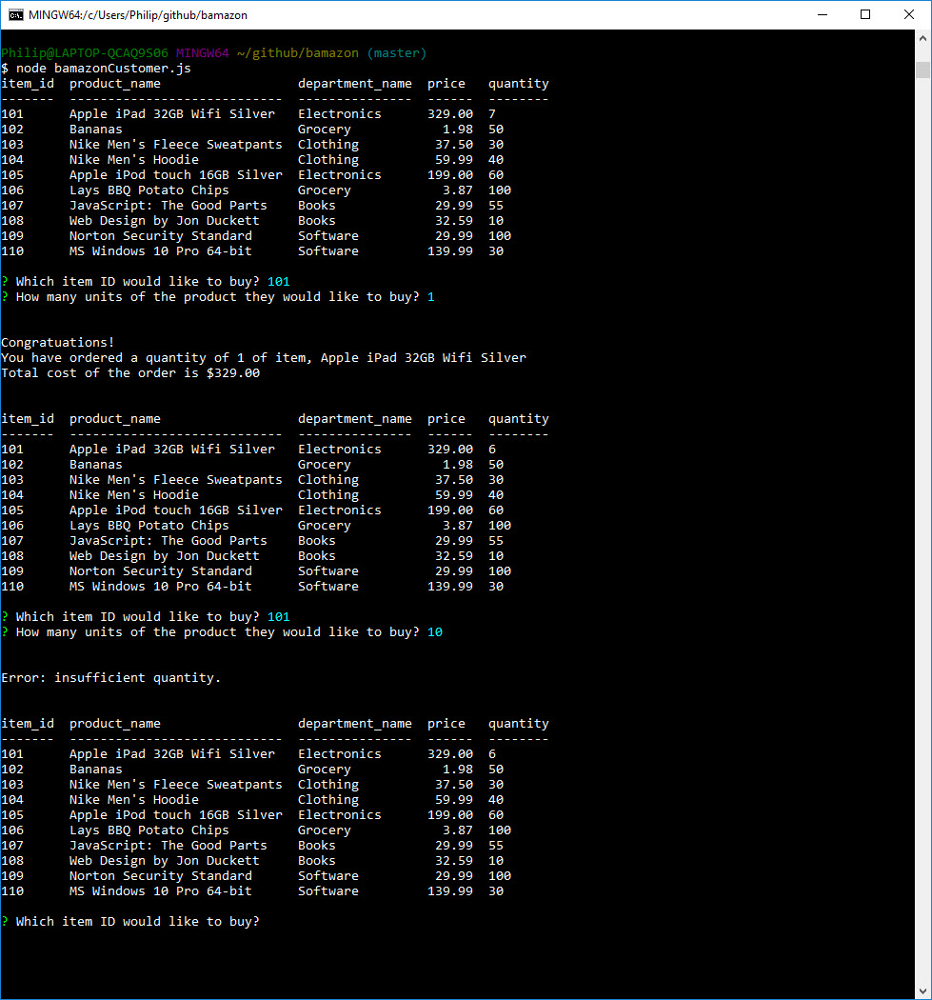

# Bamazon

## Overview

Create an Amazon-like storefront using MySQL to take in orders from customers and deplete stock from the store's inventory.  As a bonus task, your app may be able to track product sales across your store's departments and then provide a summary of the highest-grossing departments in the store.

## Bamazon Customer View

The app will prompt the user with the following messages:
* The first prompt ask the user to select the product ID they would like to buy.
* The second prompt ask the user on how many units of the product they would like to buy.
   
### Screenshot

## Bamazon Manager View

The app will prompt the user with the following messages.
* View Products for Sale
* View Low Inventory
* Add to Inventory
* Add New Product

### Screenshot

