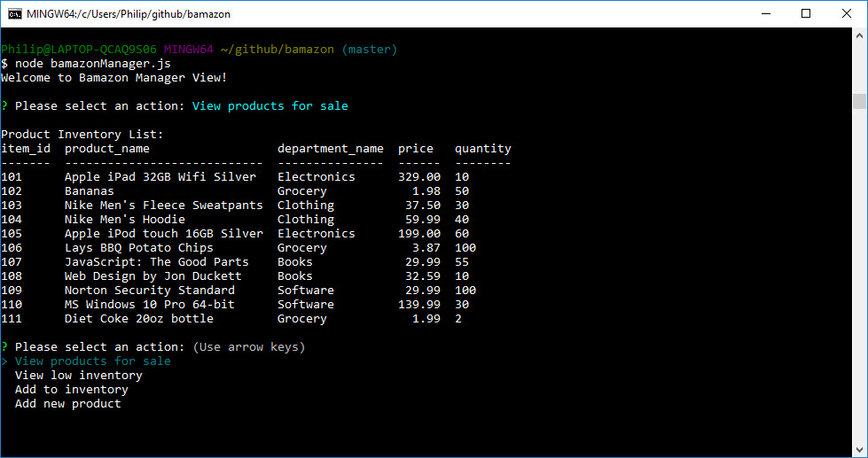
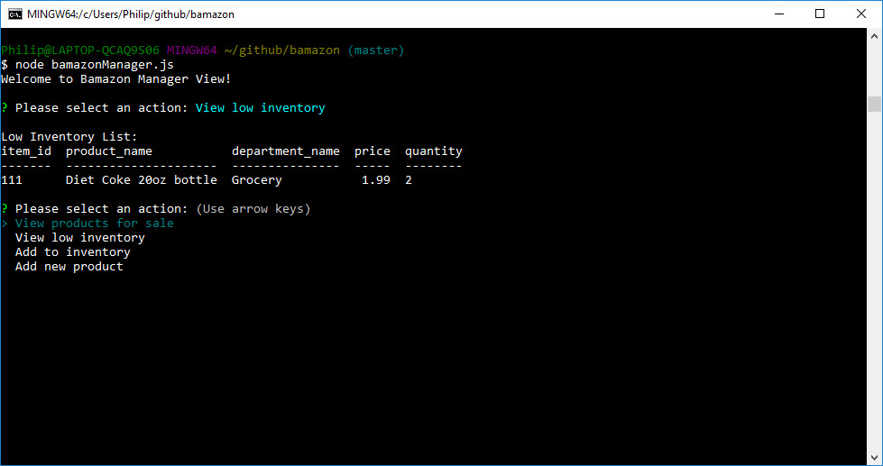
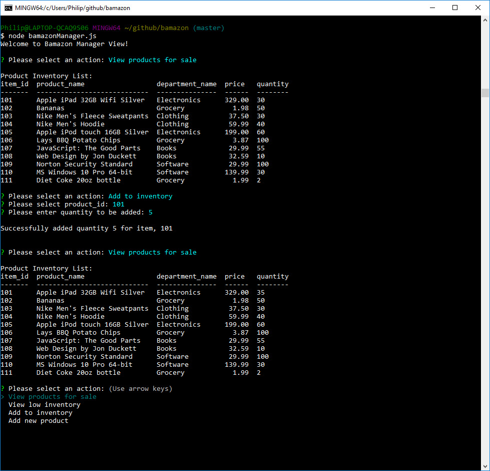
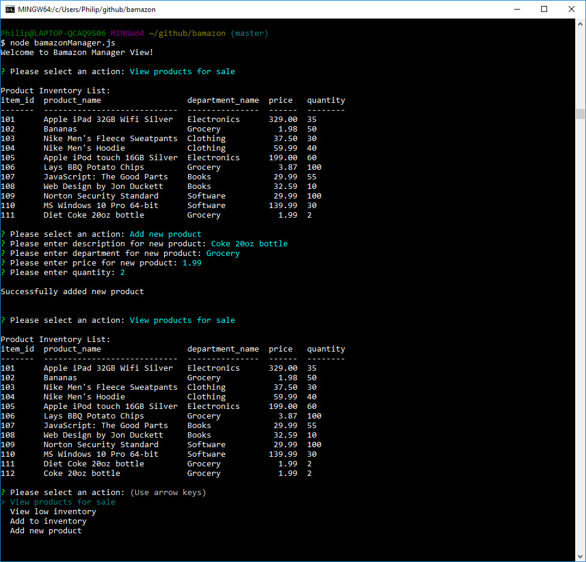

# Bamazon

## Overview

Create an Amazon-like storefront using MySQL to take in orders from customers and deplete stock from the store's inventory.  As a bonus task, your app may be able to track product sales across your store's departments and then provide a summary of the highest-grossing departments in the store.

## Bamazon Customer View

The app will prompt the user with the following messages:
* The first prompt ask the user to select the product ID they would like to buy.
* The second prompt ask the user on how many units of the product they would like to buy.

Once the customer has placed the order, the app will check if your store has enough of the product to meet the customer's request. If not, the app will log a phrase like `Insufficient quantity!`, and prevent the order from going through.

If the store _does_ have enough of the product to fulfill the customer's order, MySQL database will be updated and will show the customer the total cost of the purchase. 

### Screenshot

## Bamazon Manager View

The app will prompt the user with the following messages.
* View Products for Sale
* View Low Inventory
* Add to Inventory
* Add New Product

### View Products for Sale

If a manager selects `View Products for Sale`, the app lists every available item: the item IDs, names, prices, and quantities.

#### Screenshot

### View Low Inventory

If a manager selects `View Low Inventory`, the app lists all items with an inventory count lower than five.

#### Screenshot

### Add to Inventory

If a manager selects `Add to Inventory`, the app displays a prompt that will let the manager "adds more" of any item currently in the store.

#### Screenshot

### Add New Product

If a manager selects `Add New Product`, the app allows the manager to add a completely new product to the store.

#### Screenshot

